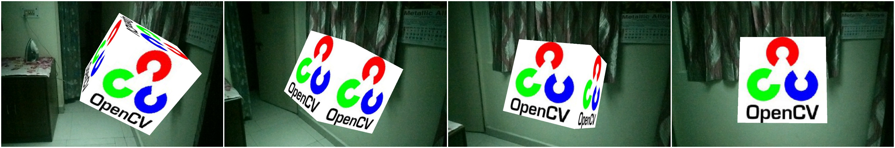

# ORB_Android

This is a repository for a complete porting and setup of ORB SLAM[1] on Android based on [2]. 

 - It includes all the compiled libraries for *android arm7*. So you can just download and 
 - It also includes build scripts, which build the source again in case you want to make changes. 
 
Checkout the APK [here](https://drive.google.com/file/d/0B6sTEEC-di3sbWhVMFhFbGRWNUk/view?usp=sharing). 

*Note: Application code will be added here soon.*

## Instructions

 - Clone this repository on your system.
 - Run *setup_dependencies.sh* //Code needs to be added
 - Open *application* folder in Android Studio and hit *build and run* //Application needs to be added

## Snapshots

## Note

This repository is still under development. The following will be added soon:

 - Application Code
 - Shell Scripts

## References

 [1][ORB SLAM Official Repository](https://github.com/raulmur/ORB_SLAM)

 [2][ORB SLAM for Android by CreativeCimmons](https://github.com/CreativeCimmons/ORB-SLAM-Android-app)

## Licence

As it extends the **GPL V3** based ORB SLAM, this code reserves the same licence.

